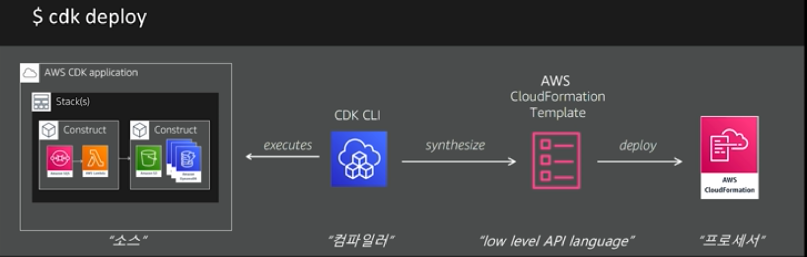
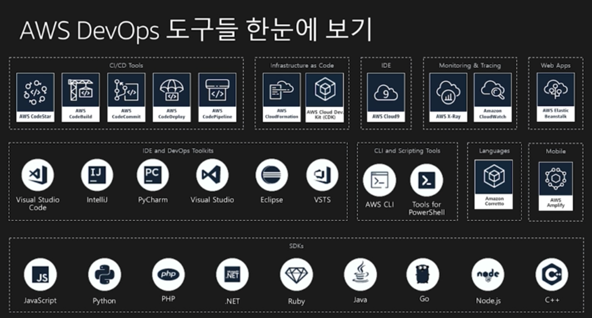
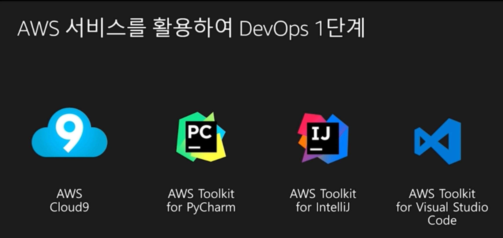
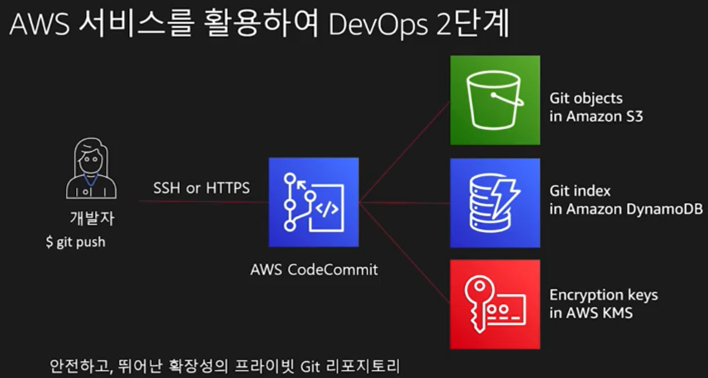
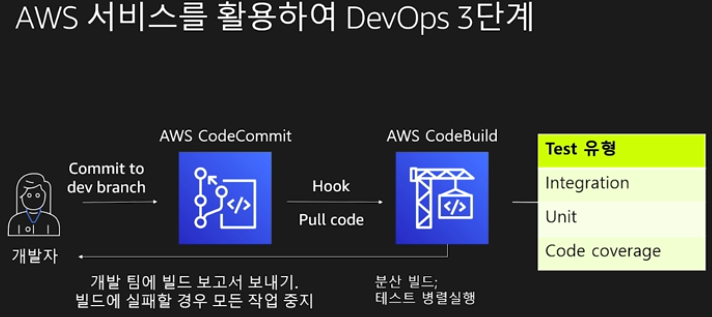
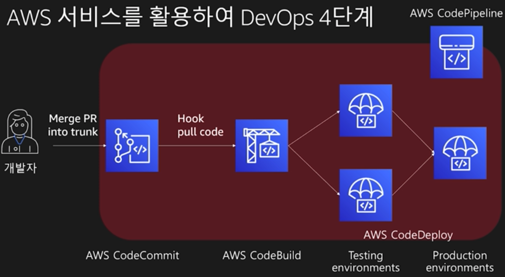
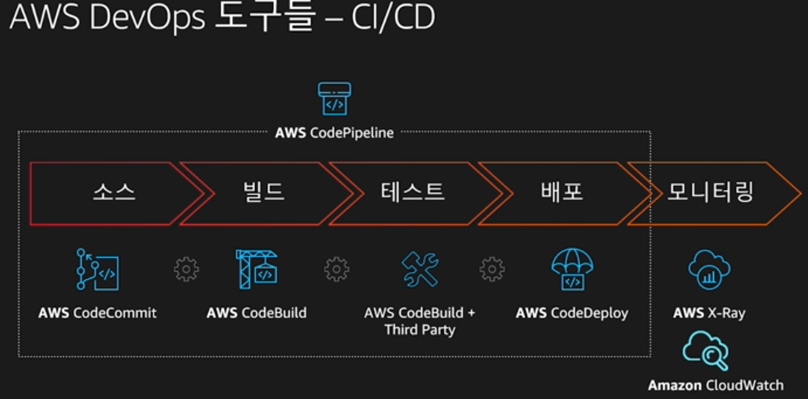
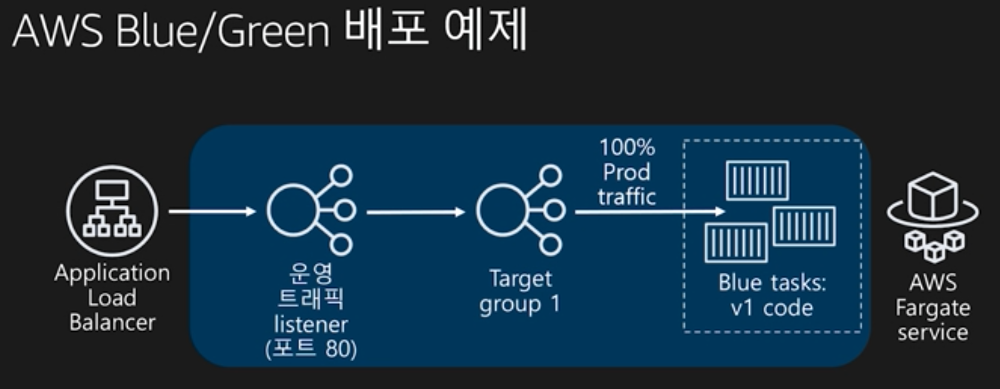
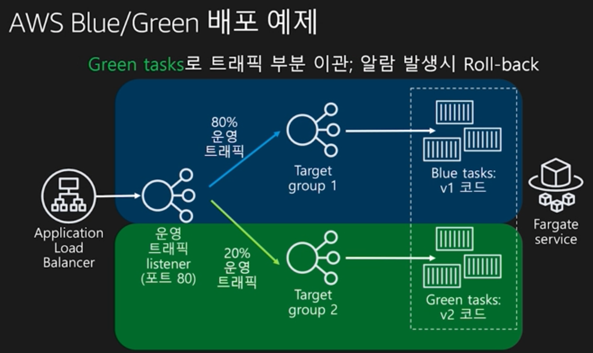
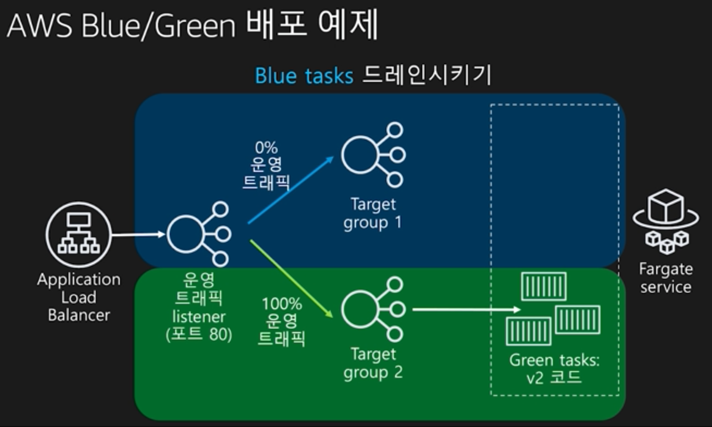

# 데브옵스(DevOps) 문화 모범 사례와 구현 도구 살펴보기

발표자 : 박선준, AWS 솔루션즈 아키텍트

### 아마존의 DevOps

0단계 : 콘솔

1단계 : 스크립트

2단계 : 선언문(Terraform, Cloud Formation)

3단계 : 컴포넌트화(CDK)

### CDK를 활용하여 인프라 환경 배포하기

#### Create a VPC

```javascript
// create vpc
// public and private subnets in 2az
// this also creates a NAT gateway
const vpc = new ec2.Vpc(this, 'NewsBlogVPC', {maxAzs: 2});
// create static web site as s3 assets
var path = require('path');
const asset = new assets.Asset(this, 'YourSampleApp', {path: path.join(__dirname, '../html')});
// define a user dat script to install & launch our app
const userData = UserData.forLinux();
userData.addCommands('yum install -y nginx', 'chkconfig nginx on', 'server nginx start');
userData.addCommands('aws s3 cp s3://${asset.s3BucketName}/${assets3ObjectKey}', 'unzip *.zip', '/bin/cp -r -n ${env}/* /usr/share/nginx/html/');
// create an auto scaling group for each environment
const asg = new autoscaling.AutoScalingGroup(this, 'YourAppgAutoScalingGroup', {
  vpc, instanceType: ec2instanceType.of(ec2.instanceClass.BURSTABLE3, ec2.instanceSize.MICRO),
  machineimage: new ec2.AmazonLinuximage(), deiredCapacity: 2, role: role, userData: userData
})
```



### DevOps Tools



















