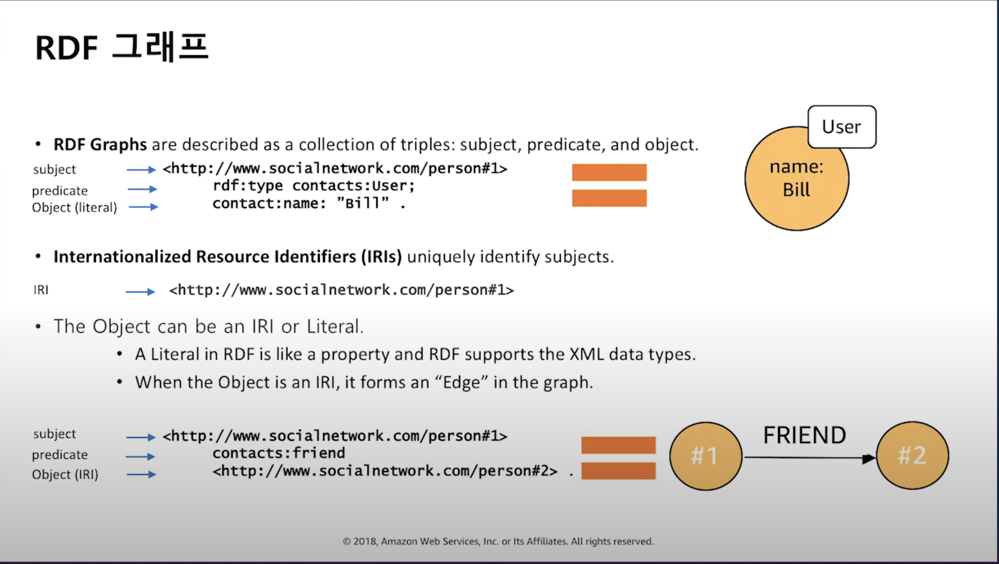
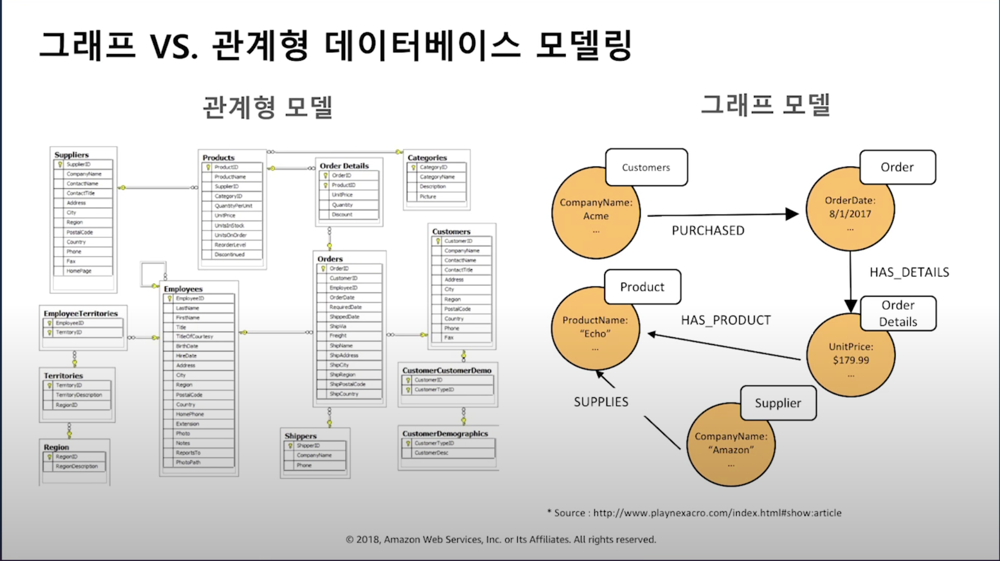
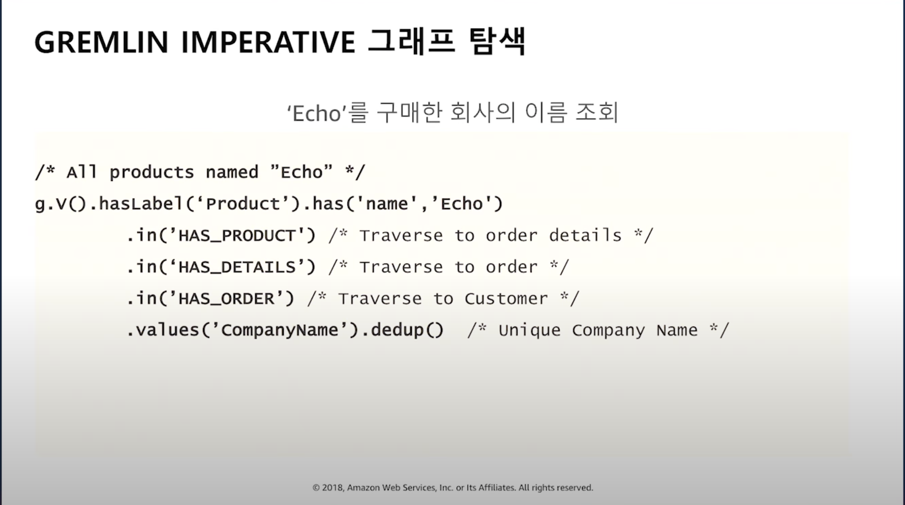

## Amazon Web Service Neptune

발표자 : 김상필 AWS 솔루션즈 아키텍트

### 상호 연결성이 높은 데이터 활용 응용 프로그램 구축

- 소셜 네트워크, 추천 서비스, 상거래 부정 탐지, 네트워크 등
- 친구나 팔로워가 구매한 내역 추천
- 친구의 친구 추천
- 지식 그래프 어플리케이션
- 이런것은 RDBS로 처리하기엔 부자연스럽고, 비효율적이며 변경에 유연하지 않은 스키마 구조를 가지고 있다.
- 관계 파악에 적합한 구조의 데이터베이스가 필요하게 되었다.

### 그래프의 종류 및 쿼리 방법

#### 주요 그래프 모델 및 프레임 워크

##### PROPERTY GRAPH

- 오픈 소스 Apache TinkerPop 프레임워크
- Gremlin Traversal Language
- 소셜 네트워크, 부정관리
- Gremlin(Apache TinkerPop 3.3)

```
user1 = g.addVertex(id, 1, label, "User", "name", "Bill");
user2 = g.addVertex(id, 2, label, "User", "name", "Sarah");
user1.addEdge("FRIEND", user2, id, 21);
```

##### RESOURCE DESCRIPTION FRAMEWORK(RDF)

- W3C 표준
- SPARQL Query Language
- 지식 그래프, 생명공학, 네트워크등

#### 기존 그래프 데이터베이스에서의 어려움

- 확장, 고가용성 유지, High Cost, 오픈소스에 대한 제한적 지원
- Neptune은 위의 2개의 프레임워크와 랭기지를 지원함.





### 프로퍼티 그래프 및 Apache Tinkerpop을 이용한 소셜 친구 추천 예제


[위 화면 라이브러리](https://github.com/bricaud/graphexp)

### 완전 관리형 그래프 데이터 베이스 Amazon Neptune상세

#### 완전 관리형 서비스

- 콘솔에서 손쉽게 구성 가능
- Multi-AZ 고가용성
- 최대 15개 읽기 복제
- 저장 시 암호화
- 전송 시 암호화
- 백업 및 복구, 특정 시점으로 복원

#### 클라우드 네이티브 스토리지 엔진 개요

- 데이터는 3개 가용 영역에 걸쳐 6개의 복제
- Amazon S3에 연속 백업 (11 9s 내구성 설계)
- 노드 및 디스크 보수를 위한 지속적 모니터링
- 복구 및 핫스팟 재밸런스를 위한 단위로 10GB 세그먼트
- 읽기 및 쓰기를 위한 쿼럼 시스템 및 낮은 응답속도 유지
- 스토리지 볼륨은 자동으로 64TB까지 증가

### 진입장벽

- 현재 tinkerPop, Gremlin의 튜토리얼 문서를 구할 수 없다. 개인적으로 공부하면서 내용을 늘려야 할 듯.

### 관련링크

- [원문](https://www.youtube.com/watch?v=DZ7HmDQxioc)