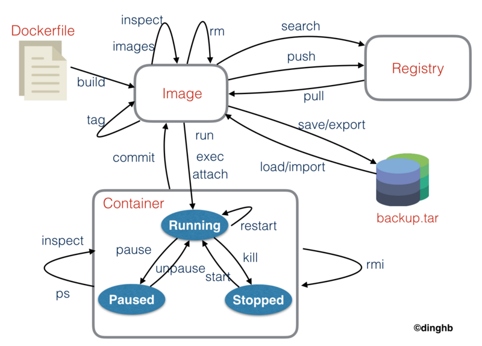

## Docker

- [도커 이미지 검색](hub.docker.com)

### docker

- 무중단 쉘 나오기 

```
ctrl + p, ctrl + q
```

- docker ip check
  - image inspect
  - container inspect

```shell
docker inspect centos_test | grep IPAddress
            "SecondaryIPAddresses": null,
            "IPAddress": "172.17.0.3",
                    "IPAddress": "172.17.0.3",
```

- docker save / load 이것을 이용하면 레파지토리 사용없이 파일을 전달해서 사용할 수 있다.

```shell
# image : save / load load는 docker image의 history까지 보여줌
$ docker save -o rabbitmq_managment.tar rabbitmq:managment
$ docker load -i rabbitmq_managment.tar

# container : export / import docker image의 history가 없음
$ docker export (컨테이너명 or 컨테이너 ID) > (컨테이너).tar
$ docker import (파일 또는 URL)
```

- container to image

```
docker commit
```

- docker engine 위에 kubernates가 올라감.

- docker compose 여러 container 를 통합 관리

- 도커 이미지가 저장되어 있는 공간 docker registry
- docker machine

docker swam
docker0라는 브릿지를 사용.

ubuntu
net-tools : ifconfig 사용하기 위해서
iputils-ping : ping 설치

- Container 와 Host의 Volume 공유

```shell
docker run --name some-mysql -v /my/own/datadir:/var/lib/mysql -e MYSQL_ROOT_PASSWORD=my-secret-pw -d mysql:tag
```

- C Adviser 실행하기
  - C adviser는 도커 모니터링 툴이다.
  - [깃헙위치](https://github.com/google/cadvisor)

```shell
docker run \
  --volume=/:/rootfs:ro \
  --volume=/var/run:/var/run:rw \
  --volume=/sys:/sys:ro \
  --volume=/var/lib/docker/:/var/lib/docker:ro \
  --volume=/dev/disk/:/dev/disk:ro \
  --publish=8088:8080 \
  --detach=true \
  --name=cadvisor \
  google/cadvisor:latest
```

- docker의 이벤트를 보여줌

```shell
docker system events
```

- docker 상태 모니터링(단일 컨테이너)

```shell
docker status container-name
```

- Docker Command



