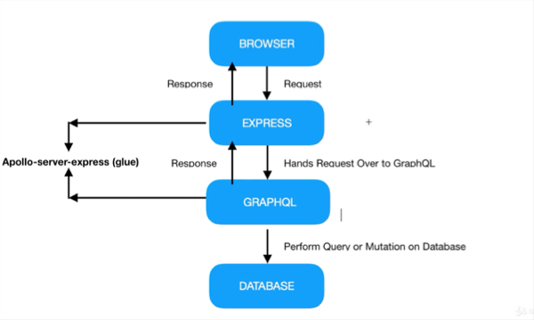
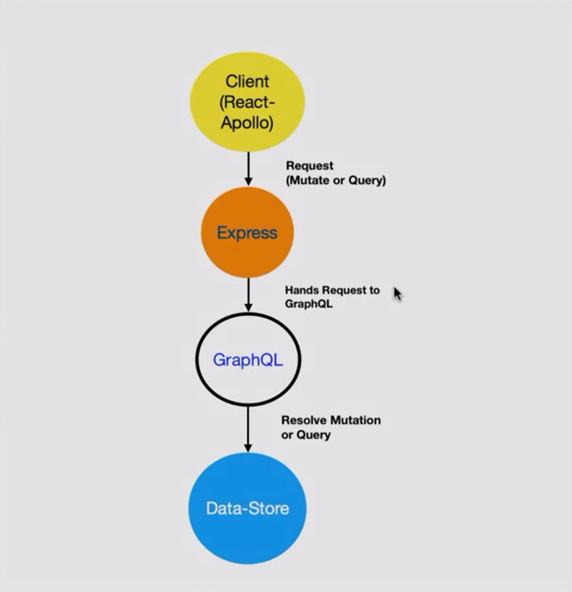
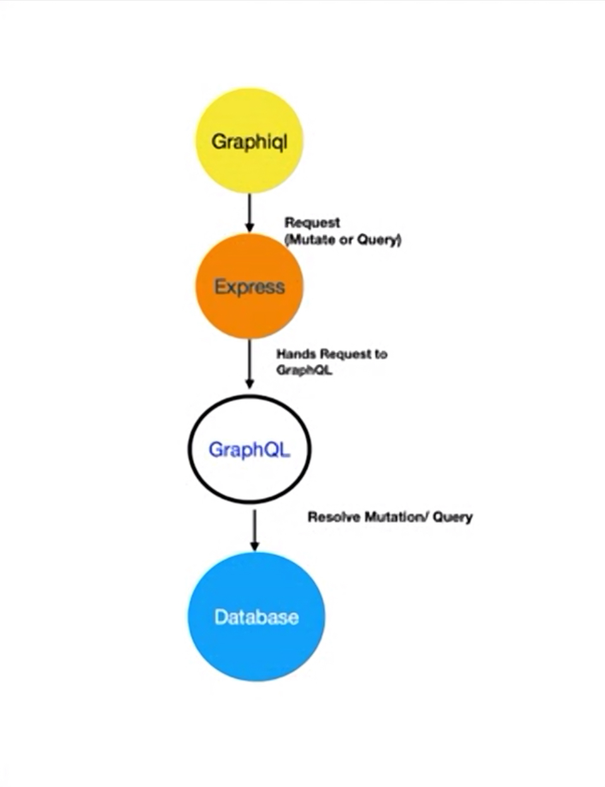

## GraphQL Queries

GraphQL을 사용하기 위해서 graphql middle ware와 apollo server express가 필요하다. 전체적인 시스템 흐름은 다음과 같다.



#### 1. Install Middle ware

- graphql을 사용하기 위해서 graqhql과 apollo server express가 필요하다.

  ```
  npm install --save graphql apollo-server-express
  ```

- 요청의 흐름도
  

#### 2. Call graphql query variables

- 이제 graphql을 사용하기 위해서 import를 사용한다.

  ```
  import {graphqlExpress, graphiqlExpress} from 'apollo-server-express';
  ```

  여기서 보면 graphQL과 graphiQL의 두개를 불러온다. 각각의 역활은 아래 그림을 보면 알 수 있다.
  
  이미지에 보면 각각의 기능은 다음과 같은 것으로 예상된다.

  - graphQL은 요청을 실행하는 부분
  - graphiQL은 시각적으로 표한하는 부분

- 이제 graphiql을 불러오는 기능을 추가하자

  ```
  server.use('/graphiql', graphiqlExpress());
  ```

  이렇게 한 후 서버를 실행한 후 `/graphql`을 호출하자.
  그러면 `Cannot read property 'endpointURL' of undefined` 에러가 발생한다. 이것은 endpointURL이 없다는 이야기로 이것을 해결하기 위해 graphiqlExpress에 endpoint를 넣어준다.

  ```
  server.use('/graphiql', graphiqlExpress({
      endpointURL: "/graphql"
  }));
  ```

  이제 다시 실행을 하면 graphql을 태스트 할 수 있는 화면이 나오게 된다.

  [^편집자주]: 버전 1의 경우 이와같은 방식으로 호출이 되었지만 2버전의 경우는 호출 방식이 변경되었다. 그에 대한 내용은 [다음](https://medium.com/@jeffrey.allen.lewis/graphql-migrating-from-apollo-server-express-1-0-to-2-0-be80f5c61bee)을 참조하도록 하자. 

#### 3. Call graphql

- 위에서 end-point로 graphql을 호출하였다. 그래서 graphqlexpress를 호출할 때 graphql을 이용한다.

  ```
  server.use('/graphql', graphqlExpress());
  ```

  그 후 호출하면 다음과 같은 메세지를 볼 수 있다.

  ```
  POST body missing. Did you forget use body-parser middleware?
  ```

- body-parser middle ware가 없다고 한다. 설치 후 import 해 준다. import 후 graphql을 사용하는 부분을 다음과 같이 변경한다.

  ```
  server.use('/graphql', bodyParser.json(), graphqlExpress());
  ```

- 실행하면 다음과 같은 메세지가 출력된다.

  ```
  Expected undefined to be a GraphQL schema.
  ```

  schema가 없단다. (뭐 계속 없다고만 하냐 ㅜㅜ) graphql2버전에서 1버전으로 다운그래이드 후 진행한 이유도 schema에 대해서 모르는데 error를 발생해서였다. 이제 여기서 개념을 잡고 넘어가도록 하자.