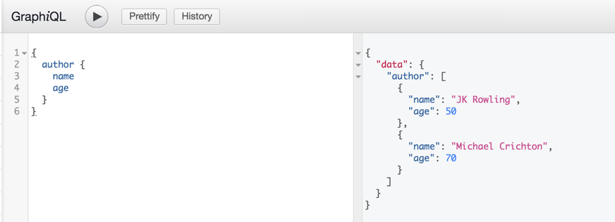

## Schema & Resolvers

### 1. Schema

Graphql을 사용하면서 제일 어려운 개념중의 하나인 schema로 들어가 보기로 하자. 

- 우선적으로 graphql-tools라는 걸 설치해야 한다(많기도 하다.) 이건 서버사이드 에서 데이터가 어떻게 보이는지 알려주는 툴이다.

  ```shell
  npm install --save graphql-tools
  ```

- schema.js파일을 생성한다.
  이것의 기능은 간단하게jpa의 schema나 DTO(Data Transfer Object)와 같은 로직을 갖고 있지 않는 순수한 데이터 객체 로 생각했다.

- json형식으로 객체들을 정의해 보자.

  ```json
  type Author = {
      age: Int
      name: String
      books: [String]
  }
  ```

  이와같이 Author이라는 데이터 타잎은 숫자형의 나이, 문자형의 이름, 문자형 배열의 책들이라는 데이터를 가지게 된다.

- graphql-tools에서 쓸수 있게 바꿔보자

  ```json
  const typeDefs = `type Author {
      age: Int
      name: String
      books: [String]
  }`
  ```

  이렇게 데이터 타잎을 ``` `키를 이용해서 감싸주면 된다.
  저기서 변수명을 typeDefs로 했는데 그 이유는 추후에 나온다.

- 이제 graphql-tools를 Import해 보자.

  ```javascript
  import {makeExecutableSchema, addMockFunctionsToSchema} from 'graphql-tools'
  ```

  - 여기서 `{}` 의 첫번째 항목으로 `makeExecutableSchema` 라는 이름을 정의 할 수 있다.
    이것은 apollo의 [graphql tool의 공식도큐먼트](https://www.apollographql.com/docs/graphql-tools) 를 보면 generate schema api로 `makeExecutableSchema` 가 있음을 확인 할 수 있으며 데이터 형을 정의해주는 기능인 거 같다. 그리고 해당 api의 필수 항목이 바로 `typeDefs` 이다. 
  - 두번째 항목으론 `addMockFunctionsToSchema` 을 정의 할 수 있다.
    이것은 apollo의 [Mocking의 공식도큐먼트](https://www.apollographql.com/docs/graphql-tools) 를 보면 Mocking의 api로 `addMockFunctionsToSchema` 가 있으며 이것은 가져온 데이터를 mocking(놀리다)의 의미로 다른 의미로 해석하면 마음대로 가지고 놀다 즉 변환하다의 의미인 거 같다.

- schema를 생성하고 수정할 준비를 한다.

  ```javascript
  const schema = makeExecutableSchema({typeDefs});
  addMockFunctionsToSchema({schema});
  ```

- 이렇게 생성한 schema를 사용하기 위해 export를 해 준다.

  ```javascript
  export default schema;
  ```

- 이제 실행시 schema를 가져와야 한다. server.js에서 schema를 사용해보자

  ```javascript
  //위에서 열심히 만든 스키마를 임포트 한다.
  import schema from './schema';
  .
  .
  .
  server.use('/graphql', bodyParser.json(), graphqlExpress({schema}))
  ```

  이렇게 해서 실행을 하자. 우리가 가져올 데이터는 작가의 이름, 나이, 책들 이므로 json형식으로 해당 데이터를 불러오도록 하자

  ```json
  {
    Author {
      name
      age
      books
    }
  }
  ```

- 실행을 하면 애러가 발생하게 된다. 애러의 내용을 살펴보자

  ```shell
  Error: Query root type must be provided.
  ```

  애러의 내용은 Query라는 root type이 없어서 애러가 발생한다는 내용이다.
  공식 홈페이지에서 다음과 같은 내용을 확인할 수 있었다.

  ```javascript
  # schema의 type 선언부에 주석은 hash(#)로 선언할 수 있다.
  # The "Query" type is the root of all GraphQL queries.
  # (A "Mutation" type will be covered later on.)
  ```

  그렇다 schema에서 우리는 Query를 선언하지 않았다. schema에서 해당 내용을 추가하도록 하자.

  ```javascript
  const typeDefs = `type Author {
          age: Int
          name: String
          books: [String]
      }
  # 이 부분에 Query가 추가됩니다.
  	type Query {
  		authors: [Author]
  	}`
  ```

- 서버가 재 실행되면 다시 페이지를 불러와 보자

  ```json
  {
      authros {
          name
          age
          books
      }
  }
  ```

  실행하면 임의의 데이터로 채워진 결과물을 볼 수 있을 것이다.

### 2.Resolvers

실제적으로 데이터를 가져오거나 하는 부분이다(현재 select에서는) 여기는 간단히 정리하고 예상치 못한 에러로 인해 고생한 내용을 적어보도록 하겠다.

#### 1. 전체 데이터 가져오기

- resolvers.js파일을 만든 후 필요한 정보를 기입한다. 이게 실 데이터베이스에서 select해서 온 데이터라고 생각하면 된다.

  ```javascript
  const authors = [
      {
          name: 'JK Rowling',
          age: 50,
          books: ['Herry Porter 1', 'Herry Porter 2', 'Herry Porter 3']
      },
      {
          name: 'Michael Crichton',
          age: 70,
          books: ['Jurassic Park 1', 'Jurassic Park 2', 'Jurassic Park 3']
      }
  ];
  ```

  위를 보면 일반적으로 데이터 형식을 select했을 때 나오는 화면이다. 서버에서 데이터가 왔다고 가정하고 다음 내용을 변수화 한다.

- resolvers를 선언한다.

  ```javascript
  const resolvers = {
      Query: {
          author: () => authors
      }
  }
  
  ```

  여기서 볼 부분은 바로 여기다

  ```javascript
  author: () => authors
  ```

  여기서 앞의 author은 schema의 author: [Author] 의 author이 호출된다는 의미이다.
  뒤의 authors는 그때 데이터를 반환한다는 의미이다.

  - 참고 => 의 기능

    ```javascript
    author: () => authors //이것과
    author: function () {
    	return authros
    }//이것은 동일한 내용이다.
    로 함수 호출 부분을 나타낸다.
    
    ```

- 이렇게 한 후 `export default resolvers;` 로 종료한다.

- 이제 schema.js의 내용을 변경하자.

  - `addMockFunctionsToSchema({schema});` 를 지운다.
  - `import resolvers from './resolver.js';` 로 파일을 호출한다.
  - `const schema = makeExecutableSchema({typeDefs, resolvers});` 로 두번째 인자로 넣어준다.
  - 주의 사항 두번째 인자의 이름을 **resolvers**로 정확히 명시해야 한다. 실습중에 맨뒤의 's'를 빼고 적은 덕분에 모든 데이터가 null로 반환되는 문제가 발생했고 해결에 많은 시간을 소비했다.

- 웹 브라우저에서 localhost:4000/graphiql을 호출하여 준다.
  호출할 항목인 author에서 가져올 부분을 선택하자 그런 후 실행하면 전체 데이터에서 원하는 컬럼만 보여준다.
  

#### 2. 원하는 데이터만 가져오기

전체 데이터가 아닌 원하는 데이터만 가져 올 수도 있다. 아래 부분은 이에 대한 내용이 들어있다.

- 우선 전체 데이터를 가져오는 부분을 변경하자.

  ```javascript
  # schema.js
  type Query {
     # authors is group of Author
     # author: [Author]
     authors: [Author] 
  }
  # resolves.js
  Query: {
      # author: () => authorsz
      authors: () => authors
  }
  ```

  이렇게 변경함으로 authors는 복수의 데이터를 가져오는 것으로 변경할 수 있다.

- 이제 resolves에 데이터를 일부 변경해 주자. 하나의 데이터를 가져올 수 있게 id를 만들어주고 유니크한 숫자를 넣어준다.

  ```javascript
  const authors = [
      {
          id: 1,
          name: 'JK Rowling',
          age: 50,
          books: ['Herry Porter 1', 'Herry Porter 2', 'Herry Porter 3']
      },
      {
          id: 2,
          name: 'Michael Crichton',
          age: 70,
          books: ['Jurassic Park 1', 'Jurassic Park 2', 'Jurassic Park 3']
      }
  ];
  ```

- 이러면 schema에서 받아야 할 내용중에 id가 추가되게 된다. 해당 부분을 수정해 주자.

  ```javascript
  const typeDefs = `
          # Comments in GraphQL are defined with the hash (#) symbol.
          type Author {
  		# add column
          id : Int
          age : Int
          name : String
          books : [String]
      }
      # The "Query" type is the root of all GraphQL queries.
      # (A "Mutation" type will be covered later on.)
      type Query {
         # authors is group of Author
         authors: [Author]
         # author is one Author add query
         author(id : Int) : Author
      }
  `;
  ```

- 당연히 resolvers에서도 쿼리가 추가되어야 한다.

  ```javascript
  const resolvers = {
      Query: {
          authors: () => authors,
          /**
           *
           * @param __ : This argument is Object to send current object, but not ues current. So write 'root' or '__'
           * @param args : Schema send argument Query author(age: Int)
           * @returns {*}
           */
          author: (__, args) => {
              // args json data use schema.js query author
              console.log('args is ', args);
              // return one author to find authors equal to args's age
              return authors.find(author => author.id === args.id);
          }
      }
  };
  ```

- 위와 같이 한 후 실행해보면 결과는 아래와 같다 설명은 다음을 참조하기 바란다.
  

  - 위에 보면 두번째 argument부터 사용을 했는데 첫번째는 'root', '__'을 사용한다. 이것은 자기자신을 나타내는건데 현재는 쓰이지 않는다.

  - 두번째 args라는 argument를 console로 출력해 보면 { id: 1 }로 들어옴을 알 수 있다. 이것을 가지고 다음 문장을 보자

    ```javascript
    // author의 id와 args의 아이디가 동일한 것을 출력하라는 의미임.
    return authors.find(author => author.id === args.id);
    ```

  이렇게 해서 데이터를 query를 이용해서 가져오는 거 까지 진행했다.