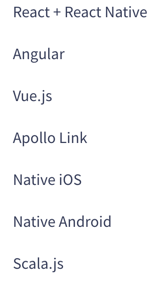

# Apollo Platform

- apollo-server : data의 형태 정의 및 가져오는 기능
- graphql : 스키마의 생성 및 스키마를 통한 쿼리의 실행
- graphql-tools : graphql develope tools

일반적으로 graph ql 강좌로 올라온 것은 apollo server를 이용해서 보여주는 백엔드 부분이 대부분이다.
클라이언트는 react 등을 사용할 수 있어야 한다.

- [apollo platform](https://www.apollographql.com/platform/) 공식 홈페이지.

apollo platform을 보면 아래 그림과 같이 메뉴가 있다.

서버부분의 하위 메뉴는 다음과 같다.

여기서 Apollo Server와 graphql-tools부분이 주 강의 내용이다.

클라이언트를 살펴보자.

보면 여러가지를 지원하지만 플래폼의 설명은 기본적으로는 react기반이며 그외의 설명들도 있다고 한다.

#### 유의사항

- 프론트 앤드 개발자가 아니라서 백엔드에 대한 설명이 대부분 일 수 있습니다.
- 자료의 출처는 영문 유투브 방송 및 공식 홈페이지 등등의 부분에서 가져왔습니다. 따라서 오역등이 있을 수 있으니 알려주시면 정정하도록 하겠습니다.
- 노드 또한 익히고 있는 중이라 설명에 빠지거나 한 부분이 존재할 수 있습니다. 이에 대해 알려주시면 보충하도록 하겠습니다.

#### Index

[Apollo Server Setting](ApolloServer1.md)

[GraphQl](ApolloServer2.md)

[Schema Resolver](ApolloServer3.md)

[[Mongo DB]](ApolloServer4.md)

[[Mutation]](ApolloServer5.md)

